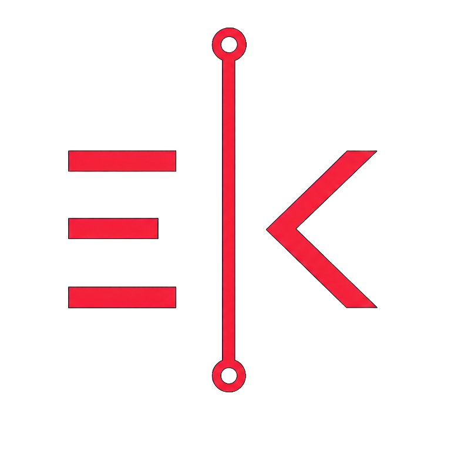

# ENES KAVAK

### SOFTWARE · AI · ML · CYBER SECURITY

Ürün geliştirme, veri analizi ve güvenlik disiplinlerini 
tek bir teknik yaklaşımda birleştiriyorum.

  
  
  
  

---

## 01. YAKLAŞIM

Full-stack geliştirme, veri bilimi ve siber güvenliği bir araya getirerek fikirleri çalışan ürünlere, veriyi kararlara ve karmaşık sistemleri daha güvenli yapılara dönüştürüyorum.

<table>
  <tr>
    <td width="33%" valign="top">
      <strong>01 / FULL-STACK</strong>  
      Güvenilir backend mimarileri, modern web arayüzleri ve çapraz platform mobil uygulamalar.
    </td>
    <td width="33%" valign="top">
      <strong>02 / DATA & AI</strong>  
      Keşifsel analiz, tahmin modelleme, ensemble learning, NLP ve LLM fine-tuning.
    </td>
    <td width="33%" valign="top">
      <strong>03 / SECURITY</strong>  
      Web pentesting, OSINT, SOC süreçleri, tersine mühendislik ve güvenli ürün geliştirme.
    </td>
  </tr>
</table>

## 02. TEKNOLOJİ

## 03. GITHUB

  
  

---

### SELECTED WORK ↓

GitHub üzerinde sabitlediğim seçili projelerimi aşağıda inceleyebilirsiniz.

<a href="https://www.eneskavak.com.tr/projeler"><strong>TÜM PROJELERİ GÖR ↗</strong></a>

