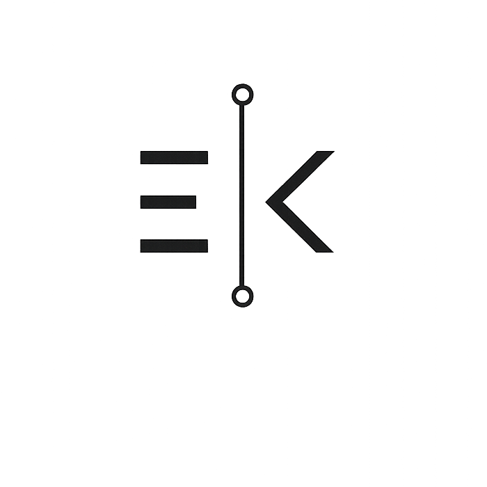

<div align="center">




### Veriden anlam çıkaran, fikirleri çalışan ürünlere dönüştüren bir geliştirici.

Makine öğrenmesi, veri analizi ve web geliştirme alanlarında projeler üretiyorum.  
Özellikle gerçek veri setleri üzerinde uçtan uca analiz, model karşılaştırma ve kullanılabilir uygulamalar geliştirmekten keyif alıyorum.

<p>
  <a href="https://github.com/eneskavakk?tab=repositories"></a>
  <a href="https://github.com/eneskavakk?tab=followers"></a>
</p>

</div>

## Odak alanlarım

```text
▸ Keşifsel veri analizi ve veri ön işleme
▸ Regresyon, sınıflandırma ve model karşılaştırma
▸ Hiperparametre optimizasyonu ve model değerlendirme
▸ Web tabanlı, kullanıcı odaklı uygulamalar
```

## Teknoloji setim

<div align="center">


</div>

## Öne çıkan çalışmalar

<table>
  <tr>
    <td width="50%" valign="top">
      <h3 align="center">AIHR</h3>
      <p>CV ve iş ilanlarını analiz ederek açıklanabilir aday uygunluk skorları, güçlü yönler ve İK raporları üreten yapay zekâ destekli eşleştirme platformu.</p>
      <p align="center"><a href="https://github.com/eneskavakk/AIHR"><strong>Projeyi incele →</strong></a></p>
    </td>
    <td width="50%" valign="top">
      <h3 align="center">Diabetes Prediction</h3>
      <p>Keşifsel veri analizi, eksik veri işleme, 28 modelin karşılaştırılması ve AdaBoost hiperparametre optimizasyonunu içeren uçtan uca ML çalışması.</p>
      <p align="center"><a href="https://github.com/eneskavakk/diabetes-prediction-model-comparison"><strong>Projeyi incele →</strong></a></p>
    </td>
  </tr>
  <tr>
    <td width="50%" valign="top">
      <h3 align="center">CarDekho Price Prediction</h3>
      <p>Araç özelliklerinden ikinci el satış fiyatını tahmin eden; EDA, öznitelik mühendisliği ve regresyon modellemelerini kapsayan notebook.</p>
      <p align="center"><a href="https://github.com/eneskavakk/cardekho"><strong>Projeyi incele →</strong></a></p>
    </td>
    <td width="50%" valign="top">
      <h3 align="center">RSA Dashboard</h3>
      <p>RSA algoritmasının matematiksel temellerini etkileşimli biçimde öğreten Streamlit tabanlı bir şifreleme laboratuvarı.</p>
      <p align="center"><a href="https://github.com/eneskavakk/rsa-dashboard"><strong>Projeyi incele →</strong></a></p>
    </td>
  </tr>
</table>

## GitHub görünümüm

<div align="center">
  
  
</div>

<div align="center">

### Birlikte bir şey geliştirelim

Yeni fikirlere, öğrenmeye ve açık kaynak iş birliklerine açığım.  
Projelerim hakkında konuşmak için GitHub üzerinden iletişime geçebilirsiniz.


</div>
