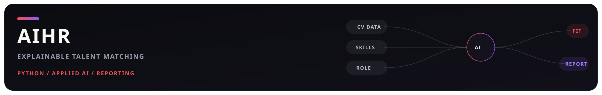
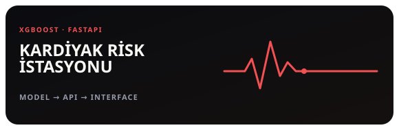
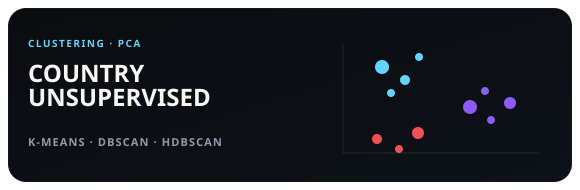

 

  

## SELECTED LABS

  
  

  <a href="https://www.eneskavak.com.tr/projeler"><strong>VIEW ALL PROJECTS ↗</strong></a>

## TOOLKIT

---

**BUILDING INTELLIGENT SYSTEMS — ONE MODEL AT A TIME.**

<a href="https://www.linkedin.com/in/eneskavakk/">LET'S CONNECT ↗</a>

