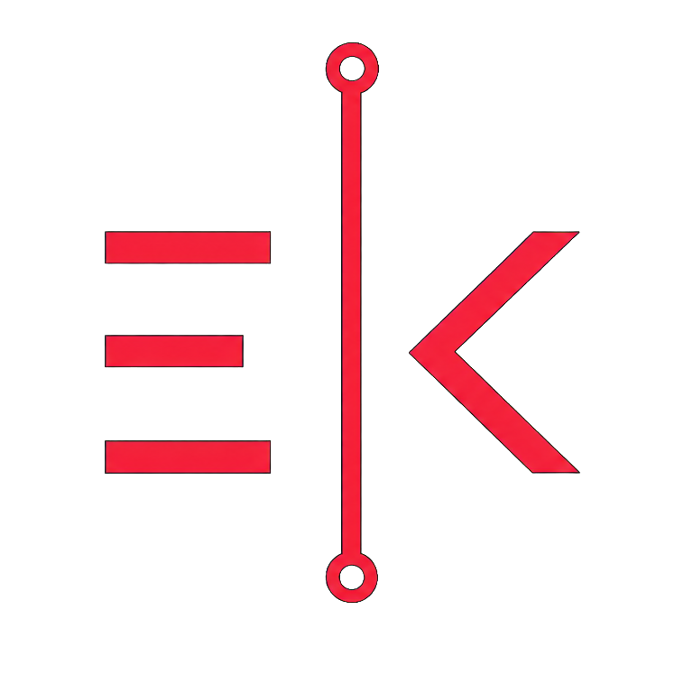
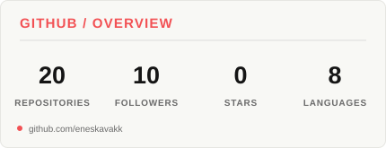
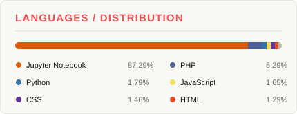

# ENES KAVAK

### APPLIED AI · MACHINE LEARNING · DATA PRODUCTS

Veriden içgörü, modelden ise **ölçülebilir, açıklanabilir ve çalışan yapay
zekâ ürünleri** geliştiriyorum.

  
  
  
  

---

## 01 / ODAK

Uygulamalı yapay zekâ ve makine öğrenmesi projeleri geliştiriyorum. Odağım;
doğru problemi tanımlamaktan veri hazırlamaya, modelleri karşılaştırıp optimize
etmekten onları API'ler ve kullanıcı arayüzleriyle çalışan ürünlere dönüştürmeye
kadar uzanan **uçtan uca ML yaşam döngüsü**.

<table>
  <tr>
    <td width="50%" valign="top">
      <strong>01 / PREDICTIVE ML</strong>  
      Sınıflandırma ve regresyon problemleri, özellik mühendisliği, ensemble
      modeller ve hiperparametre optimizasyonu.
    </td>
    <td width="50%" valign="top">
      <strong>02 / UNSUPERVISED LEARNING</strong>  
      K-Means, DBSCAN, HDBSCAN ve Agglomerative Clustering ile örüntü keşfi;
      PCA ile boyut indirgeme ve görselleştirme.
    </td>
  </tr>
  <tr>
    <td width="50%" valign="top">
      <strong>03 / EXPLAINABLE AI</strong>  
      Yalnızca skor üretmeyen; güçlü yönleri, eksikleri ve karar bağlamını
      okunabilir çıktılarla açıklayan sistemler.
    </td>
    <td width="50%" valign="top">
      <strong>04 / ML PRODUCTIZATION</strong>  
      Eğitilmiş modelleri FastAPI servisleri, etkileşimli arayüzler ve
      tekrarlanabilir veri hatlarıyla kullanılabilir ürünlere dönüştürme.
    </td>
  </tr>
</table>

## 02 / ÇALIŞMA BİÇİMİ

`PROBLEMİ TANIMLA` → `VERİYİ HAZIRLA` → `MODELLERİ KARŞILAŞTIR` 
↓ 
`OPTİMİZE ET` → `AÇIKLA` → `ÜRÜNE DÖNÜŞTÜR`

Model performansını tek bir metrikten ibaret görmüyorum. Veri kalitesini,
genellenebilirliği, hata maliyetini, açıklanabilirliği ve ürün deneyimini aynı
sistemin parçaları olarak ele alıyorum.

## 03 / SEÇİLİ AI & ML ÇALIŞMALARI

<table>
  <tr>
    <td width="50%" valign="top">
      <a href="https://github.com/eneskavakk/AIHR"><strong>AIHR ↗</strong></a>  
      CV ve iş ilanlarını analiz ederek açıklanabilir aday uyum skorları, eksik
      yetenekler, güçlü yönler ve okunabilir İK raporları üreten yapay zekâ
      platformu.
        
      <code>Python</code> <code>PHP</code> <code>Applied AI</code>
    </td>
    <td width="50%" valign="top">
      <a href="https://github.com/eneskavakk/Heart-Attack-Prob"><strong>Kardiyak Risk İstasyonu ↗</strong></a>  
      On bir klinik değişkenden XGBoost ile risk olasılığı üreten, FastAPI ve
      etkileşimli EKG arayüzüyle sunulan tahmin uygulaması.
        
      <code>XGBoost</code> <code>FastAPI</code> <code>JavaScript</code>
    </td>
  </tr>
  <tr>
    <td width="50%" valign="top">
      <a href="https://github.com/eneskavakk/lumen-diamond-price-predictor"><strong>Lumen · Diamond Price Predictor ↗</strong></a>  
      Gemolojik özelliklerden makine öğrenmesiyle elmas fiyatı tahmin eden,
      model çıktısını ürün odaklı bir arayüzle birleştiren regresyon projesi.
        
      <code>Regression</code> <code>Python</code> <code>HTML</code>
    </td>
    <td width="50%" valign="top">
      <a href="https://github.com/eneskavakk/Country-unsupervised"><strong>Country Unsupervised ↗</strong></a>  
      Ülke verileri üzerinde dört farklı kümeleme yaklaşımını ve PCA'yı birlikte
      ele alan karşılaştırmalı gözetimsiz öğrenme çalışması.
        
      <code>K-Means</code> <code>DBSCAN</code> <code>HDBSCAN</code> <code>PCA</code>
    </td>
  </tr>
  <tr>
    <td width="50%" valign="top">
      <a href="https://github.com/eneskavakk/diabetes-prediction-model-comparison"><strong>Diabetes Model Comparison ↗</strong></a>  
      Keşifsel veri analizi, eksik veri işleme, 28 modelin karşılaştırılması ve
      AdaBoost hiperparametre optimizasyonunu içeren sınıflandırma çalışması.
        
      <code>Classification</code> <code>AdaBoost</code> <code>EDA</code>
    </td>
    <td width="50%" valign="top">
      <a href="https://github.com/eneskavakk/cardekho"><strong>CarDekho Price Prediction ↗</strong></a>  
      İkinci el araç özelliklerinden satış fiyatı tahminine odaklanan veri
      hazırlama, modelleme ve değerlendirme projesi.
        
      <code>Regression</code> <code>scikit-learn</code> <code>Jupyter</code>
    </td>
  </tr>
</table>

  <a href="https://www.eneskavak.com.tr/projeler"><strong>TÜM PROJELERİ GÖR ↗</strong></a>

## 04 / TEKNOLOJİ

<strong>AI · ML · DATA</strong>

<strong>MODEL → PRODUCT</strong>

## 05 / GITHUB

  
  

## 06 / GÜVENLİK PERSPEKTİFİ

AI/ML odağımı güvenli yazılım geliştirme yaklaşımıyla destekliyorum. Kriptografi
ve parola güvenliği üzerine geliştirdiğim
<a href="https://github.com/eneskavakk/rsa-dashboard"><strong>RSA Dashboard</strong></a>
ile
<a href="https://github.com/eneskavakk/cybershield"><strong>CyberShield</strong></a>,
güvenlik bilgisini etkileşimli ürünlere dönüştürdüğüm çalışmalardan ikisi.

---

### VERİDEN KARARA, MODELDEN ÜRÜNE.

AI/ML, veri ürünleri veya disiplinler arası bir proje üzerine konuşmak için:

<a href="https://www.linkedin.com/in/eneskavakk/"><strong>LINKEDIN ↗</strong></a>
&nbsp;&nbsp;·&nbsp;&nbsp;
<a href="https://www.eneskavak.com.tr"><strong>ENESKAVAK.COM.TR ↗</strong></a>

